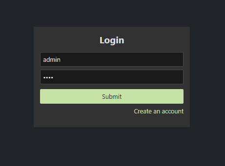
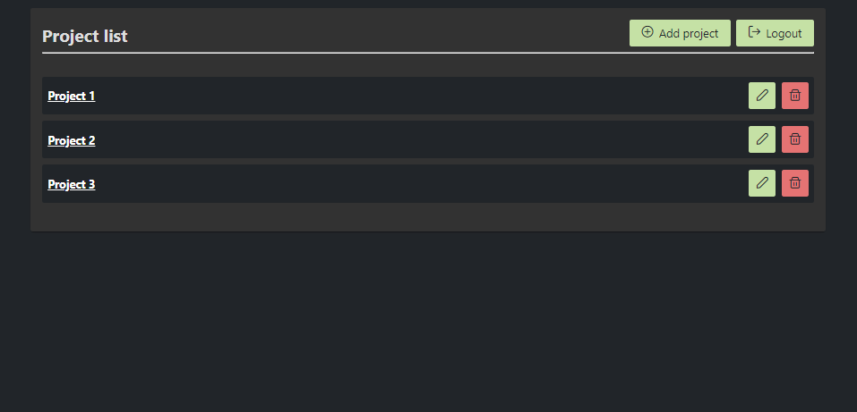
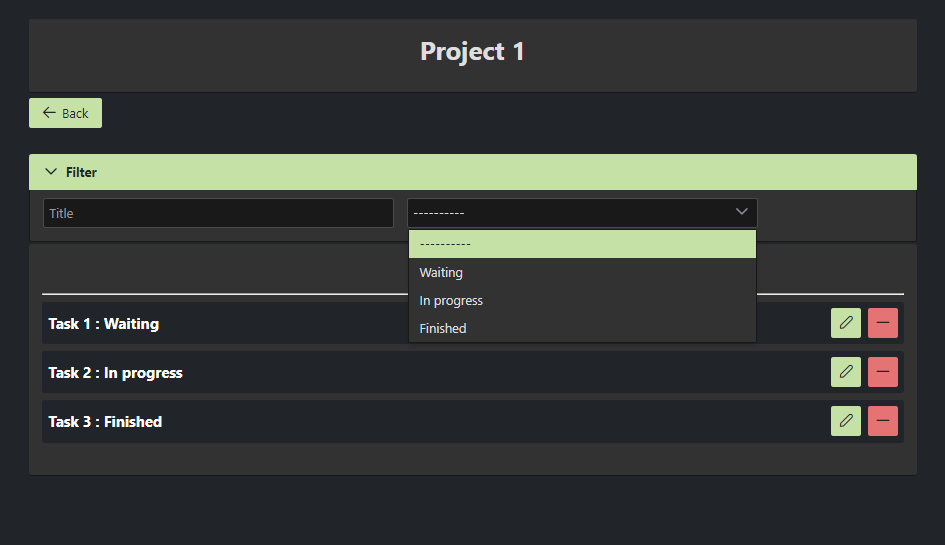

# Project-management

Simple project management app with (Angular+Akita+Primeng) and (Nestjs+Typeorm+MySQL)

## Installation

Clone this repo and install packages in both `client` and `server` folder with

```bash
npm install
```

## Before running

Make sure that you have a MySQL server running with an empty database named `nestjs_project_management`. If you want to change the database name check the `server/ormconfig.js` file.

## Run in development mode

* Client

  ```bash
  npm start
  ```

* Server

  ```bash
  npm run start:dev
  ```

You can check the API documentation in `localhost:3000/api/documentation`.

## Run in production mode

* Client

  ```bash
  npm run build
  ```

* Server

  ```bash
  npm run build
  ```

  And

  ```bash
  npm run start:prod
  ```

>  Make sure that you build the client before the server

**Ps:** I have created this project to increase my own skill (and a little bit for fun). It work but I don't think that it can fit to a real world need (in term of feature). However it show pretty well (in my opinion) how we can make `Angular` and  `Nest`  work together. Feel free to use it in whatever you want if you want.

## App screen






